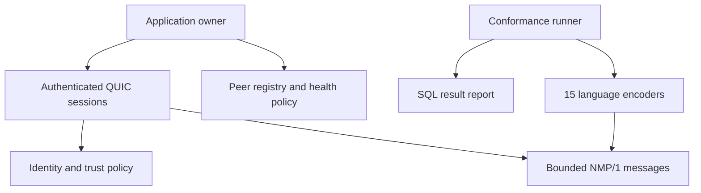

# NeuroMesh

**Secure peer communication and deterministic mesh foundations.**

[](https://github.com/krishanth7/neuromesh/actions/workflows/ci.yml)
[](https://github.com/krishanth7/neuromesh/actions/workflows/interop.yml)
[](LICENSE)

NeuroMesh is an experimental distributed-systems project built around authenticated
QUIC sessions, bounded protocol messages, and explicit peer health policies. The
Rust core is supported by a **17-language interoperability and reporting toolkit**.
Planned adaptive behavior uses graph algorithms and scheduling heuristics; the
project does not implement AGI, pretrained models, or hosted inference.

[Quick start](#quick-start) · [Measured results](#measured-results) ·
[Language toolkit](interop/README.md) · [Architecture](ARCHITECTURE.md) ·
[Engineering roadmap](https://github.com/users/krishanth7/projects/6)

## What works today

| Capability | Delivered behavior |
|---|---|
| Identity | Ed25519 signing, strict verification, domain-separated BLAKE3 fingerprints |
| Secure transport | Mutual TLS 1.3, hostname checks, explicit identity allowlists, session-bound proofs |
| Resource boundaries | Connection caps, handshake deadlines, stream limits, bounded 64 KiB envelopes |
| NMP/1 protocol | Versioned control messages, strict decoding, sender and request-ID checks |
| Peer registry | Bounded membership, duplicate rejection, monotonic health transitions, explicit removal |
| Interoperability | 15 executable Ping encoders, Rust decoder validation, SQL reporting, Bash automation |
| Measurement | Real localhost QUIC experiment with raw samples, commands, versions, and source hashes |

**Status: experimental libraries and developer tooling.** Automatic discovery,
heartbeat scheduling, adaptive routing, distributed task execution, and a live
dashboard remain on the [roadmap](ROADMAP.md). There is no autonomous mesh CLI,
production deployment, or production-readiness claim.

## Quick start

Requirements for the core: Rust stable, Cargo, rustfmt, Clippy, and Python 3.

```sh
git clone https://github.com/krishanth7/neuromesh.git
cd neuromesh
cargo build --locked --workspace --all-targets
cargo test --locked --workspace --all-features
cargo fmt --all -- --check
cargo clippy --locked --workspace --all-targets --all-features -- -D warnings
python3 scripts/check_links.py
```

Run real authenticated transport and registry integration tests:

```sh
cargo test --locked -p neuromesh-network --test quic
```

Run the complete polyglot pipeline after installing the
[documented language runtimes](interop/README.md):

```sh
bash scripts/verify.sh
```

## Measured results

The checked-in evidence records actual executions in a Linux x86_64 development
environment on 22 September 2026. Conformance inputs are boundary-test vectors,
not production traffic. Results apply to the recorded source hashes and environment.

| Verification | Observed result |
|---|---|
| Rust unit and integration suite | 26 passed, 0 failed |
| NMP/1 encoders | 570 / 570 cases passed across 15 encoders (38 each) |
| SQL reporting | Aggregates checked against observed per-case outcomes |
| Formatting, Clippy, documentation, links | All passed via `bash scripts/verify.sh` |

### Authenticated localhost QUIC

Two endpoints run in one process with ephemeral test certificates, mutual TLS,
and Ed25519 proofs. One established session exchanges 10 warmup pings followed by
100 sequential measured pings. Each Pong's nonce is checked. The authenticated
peer is registered and refreshed after valid responses.

| Metric | Recorded value |
|---|---:|
| Measured successful exchanges | 100 / 100 |
| Handshake including identity proof | 2.051 ms |
| Request/response p50 | 26.581 ms |
| Request/response p95 | 26.880 ms |
| Minimum / maximum | 0.093 / 27.268 ms |

These timings **include the transport's acknowledgment wait**. They are one local
run, not WAN latency, a throughput benchmark, a service-level objective, or an
optimized latency claim. There is no CPU isolation or multi-machine load test.
The roughly 26 ms median includes current transport behavior worth profiling.

[Raw samples and provenance](docs/results/localhost-quic.json) ·
[570 conformance outcomes](docs/results/interop.json) ·
[Reproduction and interpretation](docs/results/README.md)

```sh
python3 scripts/record_measurement.py
# Or print one fresh run without updating the recorded evidence:
cargo run --locked --release -p neuromesh-network --example measure_quic
```

## Architecture



The registry is a pure state machine. Applications supply monotonic observations,
register authenticated identities, and close duplicate sessions. The transport
provides bounded I/O; it does not silently start discovery or health timers.

- [Transport design and limits](docs/architecture/0003-quic.md)
- [Peer registry decisions](docs/architecture/0004-peer-registry.md)
- [NMP/1 specification](docs/protocol/NMP-1.md)

## 17 languages, explicit scope

**Rust, Python, JavaScript, TypeScript, Go, C, C++, Java, C#, Ruby, PHP, Perl,
Lua, R, Haskell, SQL, and Bash.**

The first 15 provide compatible Ping encoders; Rust additionally implements the
secure transport and protocol decoder. SQL stores and summarizes actual test
outcomes, while Bash orchestrates validation. These are focused integration
examples, not 17 separate mesh runtimes or complete production SDKs. See the
[implementation inventory and commands](interop/README.md). Markup and
configuration files are not counted toward the 17 languages.

## Engineering and security

Changes use substantive pull requests, recorded review findings, and CI validation.
The interoperability workflow requires every encoder and retains its per-case
report. Missing runtimes fail the run; explicit local subsets are labeled.

Review [SECURITY.md](SECURITY.md) before use. Test identities and ephemeral
certificates are for localhost verification only. Never commit private keys,
seeds, credentials, or real deployment secrets. Node IDs supplied to encoders
are untrusted claims until authenticated by the transport.

[Contributing](CONTRIBUTING.md) · [Code of conduct](CODE_OF_CONDUCT.md) ·
[Support](SUPPORT.md) · [Changelog](CHANGELOG.md)

## License

[Apache License 2.0](LICENSE).

Designed for Developers
